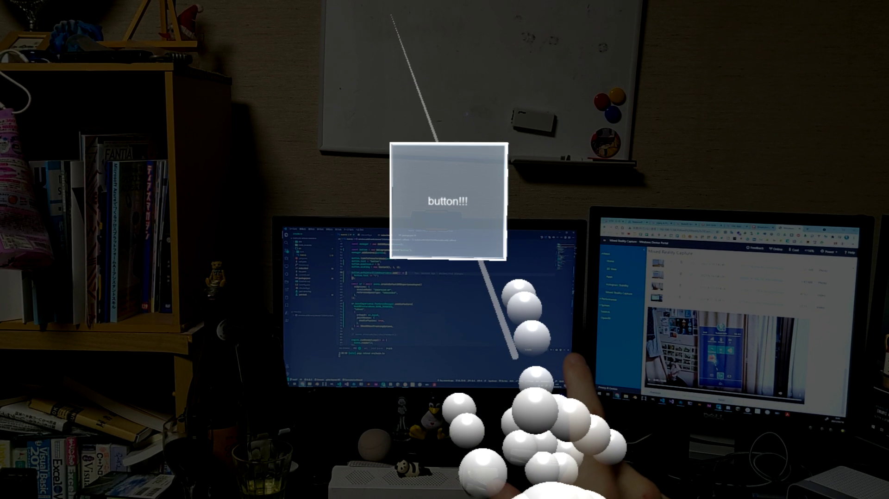
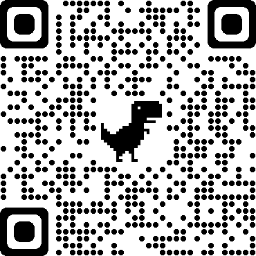

# babylon-webar-sandbox

[](https://github.com/drumath2237/babylon-webar-sandbox/actions/workflows/gh-pages.yml)

## About

HoloLens2のOSアプデ(21H1)でChromium-based Edgeが使えるようになり、
WebXRができるようになったのでBabylon.jsで試すために作った。

HandTrackingだったりHolographic Buttonだったりが使える。

https://twitter.com/ninisan_drumath/status/1393625116660043785

## Demo



（QRコード使うとHoloLensで表示するのに便利なので）

[](https://drumath2237.github.io/babylon-webar-sandbox)

## Install

```bash
yarn install
```

## Usage

WebXR APIを使うので、LAN内であってもhttpsで通信する必要がある。
ターミナルで秘密鍵、公開鍵を作成するために以下を実行する。(Windowsの場合はwslを使う)

```bash
openssl req -newkey rsa:2048 -new -nodes -x509 -days 3650 -keyout key.pem -out cert.pem
```

途中にPCのIPアドレスを指定する箇所がある。

HoloLens2のEdgeで`edge://flags`にアクセスして

- WebXR Incubation
- WebXR experience with joint tracking

を有効にする。

そのあとターミナルに戻って以下を実行し、IPを指定してHoloLens2からアクセスする。

```bash
yarn dev
```

## Contact

何かございましたら[にー兄さん](https://twitter.com/ninisan_drumath)までお願いします。
